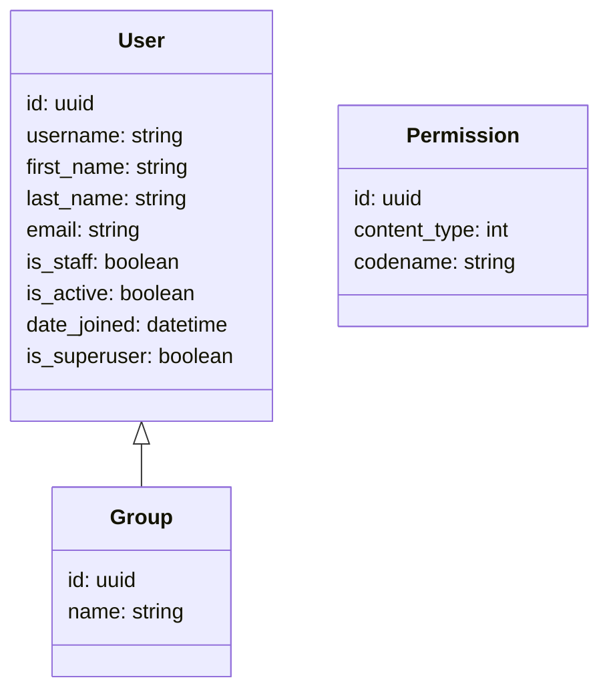

# News Manager

## Class diagram

```mermaid
classDiagram
    class User{
        id: uuid
        username: string
        first_name: string
        last_name: string
        email: string
        is_staff: boolean
        is_active: boolean
        date_joined: datetime
        is_superuser: boolean
    }
    class Group{
        id: uuid
        name: string
    }
    class Permission{
        id: uuid
        content_type: int
        codename: string
    }
    User <|-- Group
```